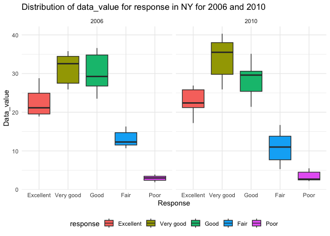
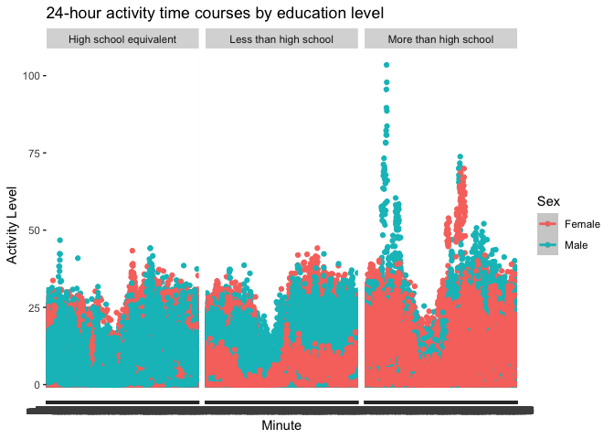

p8105_hw3_rc3520
================
Ruyi Chen
2023-10-10

## R Markdown

\#Problem 1

\##load the data from p8105.datasets

``` r
data("instacart")
instacart_df = 
  instacart |> 
  as_tibble()
```

## Look at data summary

``` r
str(instacart_df)
skimr::skim(instacart_df)
```

## Data Description:

The dataset ‘instacart’ includes 1384617 observations and 15 variables.
Every row includes information representing a single product from an
order on instacart. Identifiers for order include variables describing
date, time and number of days since prior order; identifiers for product
indlude variables describing product name, such as Bulgarian Yogurt and
Cucumber Kirby, department, such as dairy eggs and produce, aisle, such
as yogurt and fresh vegetables and add-to-cart order.In total, there are
39123 products found in 131209 orders from 131209 distinct users.

## Answer the following questions

### 1. There are 134 aisles; most items are ordered from fresh vegetables and fresh fruits.

``` r
instacart_df |>
  count(aisle) |>
  arrange(desc(n))
```

    ## # A tibble: 134 × 2
    ##    aisle                              n
    ##    <chr>                          <int>
    ##  1 fresh vegetables              150609
    ##  2 fresh fruits                  150473
    ##  3 packaged vegetables fruits     78493
    ##  4 yogurt                         55240
    ##  5 packaged cheese                41699
    ##  6 water seltzer sparkling water  36617
    ##  7 milk                           32644
    ##  8 chips pretzels                 31269
    ##  9 soy lactosefree                26240
    ## 10 bread                          23635
    ## # ℹ 124 more rows

### 2. Make a plot that shows the number of items ordered in each aisle, limiting this to aisles with more than 10000 items ordered. Arrange aisles sensibly, and organize your plot so others can read it.

``` r
instacart_df |> 
  count(aisle) |> 
  filter(n > 10000) |> 
  mutate(aisle = fct_reorder(aisle, n)) |> 
  ggplot(aes(x = aisle, y = n)) + 
  geom_point() + 
  labs(title = "Number of items ordered in each aisle") +
  theme(axis.text.x = element_text(angle = 60, hjust = 1))
```

<!-- -->

### 3. Our next table shows the three most popular items in aisles `baking ingredients`, `dog food care`, and `packaged vegetables fruits`, and includes the number of times each item is ordered in your table.

``` r
instacart_df |> 
  filter(aisle %in% c("baking ingredients", "dog food care", "packaged vegetables fruits")) |>
  group_by(aisle) |> 
  count(product_name) |> 
  mutate(rank = min_rank(desc(n))) |> 
  filter(rank < 4) |> 
  arrange(desc(n)) |>
  knitr::kable()
```

| aisle                      | product_name                                  |    n | rank |
|:---------------------------|:----------------------------------------------|-----:|-----:|
| packaged vegetables fruits | Organic Baby Spinach                          | 9784 |    1 |
| packaged vegetables fruits | Organic Raspberries                           | 5546 |    2 |
| packaged vegetables fruits | Organic Blueberries                           | 4966 |    3 |
| baking ingredients         | Light Brown Sugar                             |  499 |    1 |
| baking ingredients         | Pure Baking Soda                              |  387 |    2 |
| baking ingredients         | Cane Sugar                                    |  336 |    3 |
| dog food care              | Snack Sticks Chicken & Rice Recipe Dog Treats |   30 |    1 |
| dog food care              | Organix Chicken & Brown Rice Recipe           |   28 |    2 |
| dog food care              | Small Dog Biscuits                            |   26 |    3 |

Finally is a table showing the mean hour of the day at which Pink Lady
Apples and Coffee Ice Cream are ordered on each day of the week. This
table has been formatted in an untidy manner for human readers. Pink
Lady Apples are generally purchased slightly earlier in the day than
Coffee Ice Cream, with the exception of day 5.

``` r
instacart_df |>
  filter(product_name %in% c("Pink Lady Apples", "Coffee Ice Cream")) |>
  group_by(product_name, order_dow) |>
  summarise(mean_hr = mean(order_hour_of_day)) |>
  pivot_wider(
    names_from = order_dow, 
    values_from = mean_hr) |>
  knitr::kable(digits=2)
```

    ## `summarise()` has grouped output by 'product_name'. You can override using the
    ## `.groups` argument.

| product_name     |     0 |     1 |     2 |     3 |     4 |     5 |     6 |
|:-----------------|------:|------:|------:|------:|------:|------:|------:|
| Coffee Ice Cream | 13.77 | 14.32 | 15.38 | 15.32 | 15.22 | 12.26 | 13.83 |
| Pink Lady Apples | 13.44 | 11.36 | 11.70 | 14.25 | 11.55 | 12.78 | 11.94 |

# Problem 2

\##load the data from p8105.datasets

``` r
data("brfss_smart2010")

brfss_smart2010 = 
  brfss_smart2010 |> 
  as_tibble()
brfss_smart2010
```

    ## # A tibble: 134,203 × 23
    ##     Year Locationabbr Locationdesc     Class Topic Question Response Sample_Size
    ##    <int> <chr>        <chr>            <chr> <chr> <chr>    <chr>          <int>
    ##  1  2010 AL           AL - Jefferson … Heal… Over… How is … Excelle…          94
    ##  2  2010 AL           AL - Jefferson … Heal… Over… How is … Very go…         148
    ##  3  2010 AL           AL - Jefferson … Heal… Over… How is … Good             208
    ##  4  2010 AL           AL - Jefferson … Heal… Over… How is … Fair             107
    ##  5  2010 AL           AL - Jefferson … Heal… Over… How is … Poor              45
    ##  6  2010 AL           AL - Jefferson … Heal… Fair… Health … Good or…         450
    ##  7  2010 AL           AL - Jefferson … Heal… Fair… Health … Fair or…         152
    ##  8  2010 AL           AL - Jefferson … Heal… Heal… Do you … Yes              524
    ##  9  2010 AL           AL - Jefferson … Heal… Heal… Do you … No                77
    ## 10  2010 AL           AL - Jefferson … Heal… Unde… Adults … Yes              316
    ## # ℹ 134,193 more rows
    ## # ℹ 15 more variables: Data_value <dbl>, Confidence_limit_Low <dbl>,
    ## #   Confidence_limit_High <dbl>, Display_order <int>, Data_value_unit <chr>,
    ## #   Data_value_type <chr>, Data_Value_Footnote_Symbol <chr>,
    ## #   Data_Value_Footnote <chr>, DataSource <chr>, ClassId <chr>, TopicId <chr>,
    ## #   LocationID <chr>, QuestionID <chr>, RESPID <chr>, GeoLocation <chr>

## Data Cleaning

``` r
brfss =
  brfss_smart2010 |> 
  janitor::clean_names() |>
  filter(topic %in% c("Overall Health")) |>
  mutate(response = factor(response, levels = c("Excellent","Very good","Good", "Fair", "Poor")))
view(brfss)
```

## Answer Questions

### 1.In 2002, CT, FL, MA, NC, NJ, and PA were observed at 7 or more locations.

``` r
brfss |>
  filter(year %in% c(2002))|>
  group_by(locationabbr)|>
  summarise(count_locations = n_distinct(locationdesc)) |>
  filter(count_locations >= 7)
```

    ## # A tibble: 6 × 2
    ##   locationabbr count_locations
    ##   <chr>                  <int>
    ## 1 CT                         7
    ## 2 FL                         7
    ## 3 MA                         8
    ## 4 NC                         7
    ## 5 NJ                         8
    ## 6 PA                        10

### 2. In 2010, CA, CO, FL, MA, MD, NC, NE, NJ, NY, OH, PA, SC, TX, and WA were observed at 7 or more locations.

``` r
brfss |>
  filter(year %in% c(2010))|>
  group_by(locationabbr)|>
  summarise(count_locations = n_distinct(locationdesc)) |>
  filter(count_locations >= 7)
```

    ## # A tibble: 14 × 2
    ##    locationabbr count_locations
    ##    <chr>                  <int>
    ##  1 CA                        12
    ##  2 CO                         7
    ##  3 FL                        41
    ##  4 MA                         9
    ##  5 MD                        12
    ##  6 NC                        12
    ##  7 NE                        10
    ##  8 NJ                        19
    ##  9 NY                         9
    ## 10 OH                         8
    ## 11 PA                         7
    ## 12 SC                         7
    ## 13 TX                        16
    ## 14 WA                        10

### 3. Comment:this is a spaghetti plot illustrating the average data_value over time for ‘Excellent’ responses within each state across years. A glimpse of observation suggests a consistent trend across various states. Nevertheless, the multitude of overlapping lines representing each state creates a density that makes it difficult to distinguish them from one another.

``` r
# Construct a data set that is limited to Excellent responses, and contains, year, state, and a variable that averages the data_value across locations within a state.
brfss_excellent =
  brfss |>
  filter(response %in% c("Excellent"))|>
  group_by (locationabbr, year)|>
  summarise( ave_data_value = mean(data_value, na.rm = TRUE))
```

    ## `summarise()` has grouped output by 'locationabbr'. You can override using the
    ## `.groups` argument.

``` r
#Make a plot showing a line for each state across years
ggp_brfss_excellent =
  brfss_excellent |>
  ggplot(aes(x = year, y = ave_data_value, group = locationabbr, color = locationabbr)) + 
  geom_point() + 
  geom_line() +
  labs(title = "Data value average over time within each state",
       x = "Year", y = "Average Crude Score", color = "State") +
  theme_minimal() +
  theme(legend.position = "bottom")
ggp_brfss_excellent
```

<!-- -->

### 4.Comment:this two-panel plot shoes that in year 2006 and 2010, the distribution medians of data value in different response group rank consistently. The highest to lowest medians ranking is: very good, good, excelent, fair and poor. However, the spread of data value for good response group became more condensed in 2010; the spread of data value for fair and poor response group became more loose in 2010.

``` r
#Make a two-panel plot showing, for the years 2006, and 2010, distribution of data_value for responses (“Poor” to “Excellent”) among locations in NY State.
ggp_brfss_response = 
  brfss |>
  filter (year %in% c(2006,2010), locationabbr %in% c("NY")) |>
  group_by (year) |>
  ggplot(aes(x= response, y= data_value, fill = response))+
  geom_boxplot() + 
  facet_grid(.~year)+
  labs(title = "Distribution of data_value for response in NY for 2006 and 2010",
       x = "Response", y = "Data_value") +
  theme_minimal()+
  theme(legend.position = "bottom")
ggp_brfss_response
```

<!-- -->

# Problem 3

## Load Data

``` r
demographic_df =
  read.csv("./data/nhanes_covar.csv", skip = 4) 
view(demographic_df)
accelerometer_df = 
  read_csv("./data/nhanes_accel.csv")
```

    ## Rows: 250 Columns: 1441
    ## ── Column specification ────────────────────────────────────────────────────────
    ## Delimiter: ","
    ## dbl (1441): SEQN, min1, min2, min3, min4, min5, min6, min7, min8, min9, min1...
    ## 
    ## ℹ Use `spec()` to retrieve the full column specification for this data.
    ## ℹ Specify the column types or set `show_col_types = FALSE` to quiet this message.

``` r
view(accelerometer_df)
```

## Data Manipulation

``` r
demographic_df =
  demographic_df |>
  janitor::clean_names()|>
  drop_na()|>
  filter (age >= 21)|>
  mutate(education = case_when(
    education == 1 ~ "Less than high school",
    education == 2 ~ "High school equivalent",
    education == 3 ~ "More than high school"),
  sex = case_when(
    sex == 1 ~ "Male",
    sex == 2 ~ "Female"
  ))

view(demographic_df)

accelerometer_df = 
  accelerometer_df|>
  janitor::clean_names()|>
  pivot_longer(
    cols = starts_with("min"),
               names_to = "minute",
               values_to = "minute_value")
view(accelerometer_df)
```

## Merge data

``` r
demo_accel_df =
  demographic_df %>%
  inner_join(accelerometer_df, by = "seqn")
view(demo_accel_df)
```

\##Comment: From the table, in both “Less than high school” and “More
than high school” groups, numbers of females are more than number of
males; while in “High school equivalent”, there are more males than
females. Most of the females and males have pursued education in high
school or beyond high school.

``` r
#Table for the number of men and women in each education category
demographic_df |>
  group_by(sex, education)|>
  summarise(count_education = n())|>
  pivot_wider(
    names_from = education,
    values_from =count_education
  )|>
  knitr::kable()
```

    ## `summarise()` has grouped output by 'sex'. You can override using the `.groups`
    ## argument.

| sex    | High school equivalent | Less than high school | More than high school |
|:-------|-----------------------:|----------------------:|----------------------:|
| Female |                     23 |                    28 |                    59 |
| Male   |                     35 |                    27 |                    56 |

\##Comment: From the boxplot, for both “less than high school” and “More
than high school”, the distribution of age for female and male are very
similar while in these two education category, the spreads of the middle
half of the age distribution for female are more concentrated than the
the spreads of the middle half of the age distribution for male(IQR for
“less than high school” falls between 45-70; IQR for “More than high
school” falls between 30-60). In the “High school equivalent” education
category, the median of the age for male which is around 55 is much
smaller than the median of the age for females which is around 62. In
this categrory, the IQR of age distribution for female falls between
45-75; the IQR of age distribution for male falls between 35-65.

``` r
#Plot showing distributions of age for men and women in each education category
demographic_df |>
  ggplot(aes(x= sex , y= age, fill = education))+
  geom_boxplot() +
  facet_grid(.~education)+
  labs(title = "Distribution of age for men and women in each education category",
       x = "Sex", y = "age") +
  theme_minimal()+
  theme(legend.position = "bottom")
```

<!-- -->

``` r
# Dataframe for total activity
total_activity_df = 
  demo_accel_df|>
  group_by(seqn)|>
  summarize(total_activity=sum(minute_value))|>
  inner_join(demographic_df, by = "seqn")
view(total_activity_df)
```

## Comment:For both female and male in “Less than high school” education category, their highest total activity was achieved in early 20s. For people in “High school equivalent” education category, their highest total activity was achieved around 40. For malas in “More than high school” education category, their total activity level did not fluctuate a lot from 20 to 50; for females, their total activity level did not fluctuate a lot from 20 to 60.In generall, females and males with same education category seem to have very similar tatal activity flucatuation patterns along ages.

``` r
total_activity_df|>
  ggplot(aes(x=age, y=total_activity, color=sex))+
  geom_point()+
  geom_smooth()+
  facet_grid(.~education)+
  labs(title = "Total activity against age in different education levels for females and mals",
       x = "Age",
       y = "Total Activity",
       color = "Sex")+
  theme(legend.position = "bottom")
```

    ## `geom_smooth()` using method = 'loess' and formula = 'y ~ x'

<!-- -->

``` r
#A three-panel plot that shows the 24-hour activity time courses for each education level and use color to indicate sex
demo_accel_df |>
  ggplot( aes(x = minute, y = minute_value, color = sex)) +
  geom_point() +
  geom_smooth() +
  facet_grid(.~education)+
  labs(title = "24-hour activity time courses by education level",
       x = "Minute",
       y = "Activity Level",
       color = "Sex")
```

    ## `geom_smooth()` using method = 'loess' and formula = 'y ~ x'

<!-- -->
